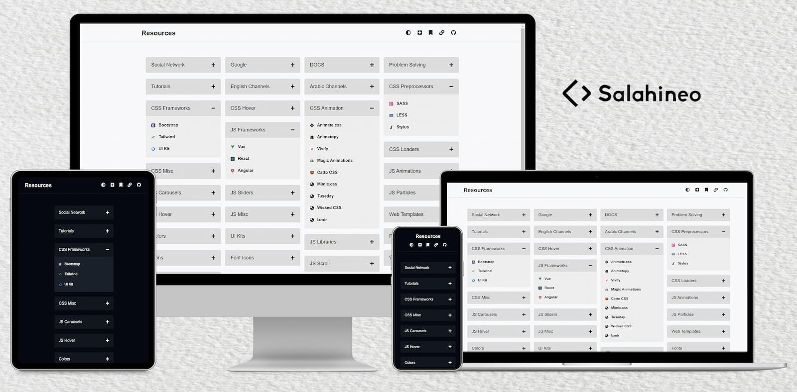

<h1 align="center">Bookmarks Manager</h1>

  

## Table of Contents

- [Goal](#goal)
- [Benefits](#benefits)
- [Installation](#installation)
- [Contributing Guidelines](#contributing-Guidelines)
- [Technologies](#technologies)
- [Contact](#contact)
- [Copyright and license](#copyright-and-license)

### Goal

This is bookmarks manager application with free resources for web developers and designers. I coded this project to practice on my knowledge of HTML, CSS, Bootstrap, jQuery, jQuery UI, AJAX, PHP, MySQL in a real project.

### Benefits

Here are some ideas to benefit from this project:

- Take this project as a task and try to make it, and if you could not do a specific section, see how I make it in the
  source code (use comments to reach this section).
- Extract a code of a specific section and use it in your project.
- Review source code to see how other people code their projects.
- Edit on this project after studying its code well, to know how to work in pair-programming with other people
- Upgrade this project, and add your own sections or pages

### Installation

Here are the guidelines to run this project on your localhost:

1. Download, then install [XAMPP](https://www.apachefriends.org/download.html) web server
2. Download this project, then rename its directory to `resources`
3. Copy the `resources` directory to the `htdocs` directory which exists in XAMPP installation path
4. Start XAMPP control panel from your Desktop, then start `Apache` web server, and `MySQL` server
5. Open your browser, and type `http://localhost/phpmyadmin`, to open PHPMyAdmin home page
6. Create a new database with the name `s_resources`
7. Import the `s_resources.sql` file to this database (This file located in `sql` directory)
8. Open your browser, and type `http://localhost/resources`, to open the home page of the website

> You must make a virtual host like `resources.local` for this project, otherwise you will encounter non-accurate routes. If you don't know how to make virtual hosts in XAMPP, follow these instructions for [Windows](https://gist.github.com/salahineo/3ee4333450a13d4cfedf330da191e822#file-xampp-virtual-host-windows-md), or [Linux](https://gist.github.com/salahineo/3ee4333450a13d4cfedf330da191e822#file-xampp-virtual-host-linux-md).

> Don't forget to edit the `/include/database.php` file with your Database credentials

### Contributing Guidelines

Here are the guidelines to contribute to this project for adding more resources:

- Add any resources you want in your localhost, then export the database file and replace it with the old one which exists in the sql directory

- Pull requests allowed with a change in the database (.sql) file only

- Pull request title should include resource name, resource section
  
  - Example: `[Bootstrap] -> [CSS Frameworks]`

- It is better to add resource link in the pull request comment section
  
  - Example: `[URL] -> [https://getbootstrap.com/]`

- Adding to single resource section, or create new resource section in one pull request as it will allow for easier review
  
  > You can use this [chrome extension](https://chrome.google.com/webstore/detail/get-favicon/gpipahagclehninhhjkhbkliinfofnhe) to download websites favicons for your links

### Technologies

- HTML
- CSS
- Bootstrap
- jQuery
- jQuery UI
- AJAX
- PHP
- MySQL

> This application is fully responsive

### Contact

- [Github](https://github.com/salahineo) :octocat:
- [LinkedIn](https://linkedin.com/in/salahineo) 💼
- [Facebook](https://facebook.com/salahineo) 😎
- [Twitter](https://twitter.com/salahineo) 🐤
- [Website](https://salahineo.github.io/salahineo/) :globe_with_meridians:
- <a href="mailto:salahineo.work@gmail.com">Email</a> :email:

### Copyright and license

- **[GPLv3](https://www.gnu.org/licenses/gpl-3.0)**
- **© 2021 | Mohamed Salah**

---

**If you find my work good, consider giving it a :star: or fork-ing to show some :heart:. It helps me stay on track and be motivated.**

> **Explore all of my projects from [Here](https://github.com/salahineo/Projects-Reference)**

---
